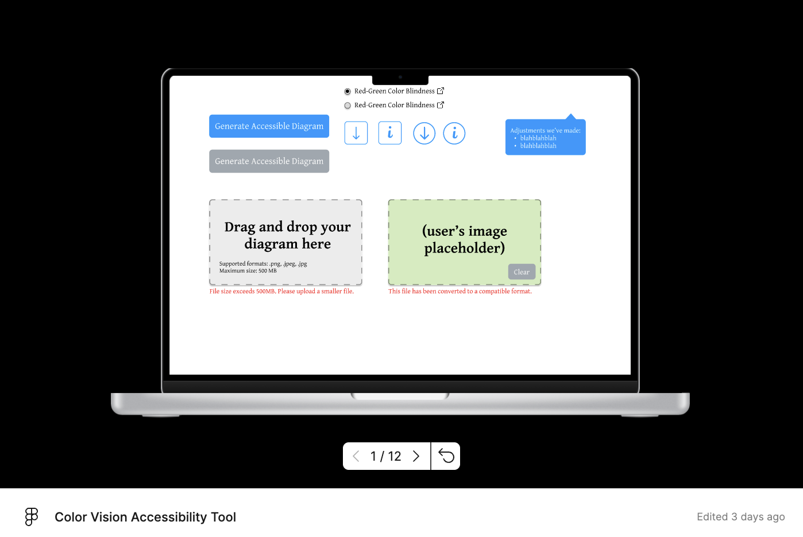

# Updated Problem Statement:
Some colorblind students in the course may struggle to interpret figures that rely heavily on color for differentiation, which can hinder their learning efficiency. Moreover, these students often **find their own workarounds** instead of reporting the issue, either because they do not want to *be treated differently* or simply *prefer to keep this need private*.

On the other hand, TAs may **unintentionally** create lecture slides with figures that depend on color differentiation, making them inaccessible to colorblind students. This happens either because they are **unaware of the issue** or because they **do not realize there are students in their course who need this accommodation**—especially since students rarely report their needs.

As a result, an ongoing accessibility gap remains, with affected students struggling to understand visual materials effectively.

# Paper prototype:

[//]: # (<iframe width="100%" height="475" src="https://embed.figma.com/proto/66YLf7nN2Ez0BIp0FIVnY4/Color-Vision-Accessibility-Tool?node-id=1-31&p=f&t=xUsRHa7KvmT68NWZ-0&embed-host=github" allowfullscreen></iframe>)
[//]: # (<iframe width="100%" height="475" src="https://embed.figma.com/design/66YLf7nN2Ez0BIp0FIVnY4/Color-Vision-Accessibility-Tool?embed-host=github" allowfullscreen></iframe>)

# Takeaways from the feedback:
- **Enhance usability** by adding download buttons for easier access to processed files.  
- **Improve clarity** by including more instructional text to guide users through the tool’s features.  
- **Strengthen security** by implementing file screening to prevent misuse of the upload function.

# Design Goals:
We identified four key design goals for developing a tool that helps ensure educational materials are accessible to colorblind students. These goals are informed by our research and feedback from our user research.

## Goal 1: Support Knowledge Building
1. **What is the goal?** To provide teaching assistants (TAs) with the necessary knowledge and resources to understand how colorblind students perceive figures and how to create accessible visual materials.
2. **Why is it important?**
Many TAs are unaware of accessibility issues related to color blindness. User research indicated that TAs often do not consider accessibility when designing lecture slides, either because they are unaware of the issue or do not realize students have this need. One TA mentioned, "I didn’t even think about color blindness when preparing my slides. No one ever brought it up." 
3. **How will you design for this goal?** The tool will:
   1. Provide insights into how colorblind students perceive figures.
   2. Include external links to general information about color blindness.
   3. Offer educational components on accessibility best practices, with resources for further learning.
   4. Provide code snippets and tutorials, tailored to the TA's preferred programming language or tool, demonstrating how to create accessible visuals.

## Goal 2: Enable Flexibility for Instructors
1. **What is the goal?**
To offer TAs multiple adjustment options for improving figure accessibility, while allowing those who prefer manual adjustments to receive guidance tailored to their specific tools and coding environments.
2. **Why is it important?**
Different TAs have diverse teaching styles and technical preferences. User research showed that some TAs prefer adding patterns, while others want to change the colors. There are some needs to retain control over the final output, especially when maintaining high resolution of their figure. 
3. **How will you design for this goal?** The tool will:
   1. Provide alternative adjustments, such as adding patterns or changing colors of the figure.
   2. Include an option where TAs can choose their coding language or design tool and receive some general instructions on how to apply accessibility improvements within that specific context.

## Goal 3: Emphasize Accessibility
1. **What is the goal?**
To ensure all figures and visual elements are accessible to students with color vision deficiencies.
2. **Why is it important?**
The primary goal of this tool is to bridge the accessibility gap. Research highlights that students with disabilities often do not report issues due to fear of being treated differently. One student shared, "I usually just try to manage on my own. I don’t want to seem like I need special treatment." Ensuring accessibility can increase the learning efficiency of colorblind students
3. **How will you design for this goal?** The tool will:
   1. Automatically analyze figures for color-based accessibility issues (e.g., red-green confusion).
   2. Highlight problematic visuals and suggest adjustments such as adding patterns or changing colors.

## Goal 4: Ensure Fast Response and Ease of Use
1. **What is the goal?**
To create a tool that is quick to respond and self-explanatory, minimizing the time and effort required for TAs to conduct accessibility checks.
2. **Why is it important?**
User research showed that TAs often do not want to spend too much time on accessibility checks. Among 7 TAs we interviewed, 6 of them don’t want to spend more than 5 minutes per slides for accessibility check
3. **How will you design for this goal?** The tool will:
   1. Use a streamlined interface with minimal setup and a clear, guided workflow.
   2. Provide instant analysis of figures and generate actionable suggestions within seconds.

# Formal Publication Style Design Goals: 
We refer to the paper [*Design Goals for Playful Technology to Support Physical Activity Among Wheelchair Users*](https://dl.acm.org/doi/10.1145/3290605.3300262) published at CHI 2019.

We identified four key design goals for developing a tool that helps ensure educational materials are accessible to colorblind students. These goals are based on our research and feedback from instructors, aiming to make accessibility improvements easy, flexible, and effective.

#### Design Goal 1: Support Knowledge Building

Many instructors and teaching assistants (TAs) don’t realize how colorblind students experience visual materials, making it hard to identify and fix accessibility issues (Relevant Factor: Knowledge). To bridge this gap, the tool should educate users about the challenges colorblind students face and offer practical solutions for making their materials more accessible.

Existing resources, such as WCAG guidelines and color simulators, can raise awareness, but they often stop short of providing clear, actionable steps for improvement. Instructors need a tool that doesn’t just flag problems but also helps them understand why certain visuals are inaccessible and how to fix them. To address this, the tool should include explanations of common accessibility mistakes, annotated examples, and links to external guidelines. It should also provide code snippets and tutorials tailored to different programming languages and software. By embedding these features directly into the tool, we can make it easier for instructors to learn and apply accessibility improvements without extra effort.

#### Design Goal 2: Enable Flexibility for Instructors

Different instructors have different ways of creating teaching materials, so the tool needs to be adaptable (Relevant Factor: Perceived Control). Some may prefer automatic adjustments that quickly fix accessibility issues, while others may want more control over how their visuals are modified. The tool should accommodate both approaches by offering automated suggestions alongside manual adjustment options.

Most existing accessibility tools take a one-size-fits-all approach, which can be frustrating for instructors who work with different file formats, software, or design preferences. To make the tool more useful, it should provide recommendations tailored to the instructor’s specific workflow—whether they are using PowerPoint, LaTeX, or a programming language like Python. If an instructor prefers to make manual changes, the tool should offer targeted guidance that aligns with their chosen platform. By allowing instructors to decide how they want to implement changes, the tool will fit more naturally into different teaching styles and encourage broader adoption.

#### Design Goal 3: Emphasize Accessibility

The main goal of this tool is to ensure that visual materials are truly accessible for students with color vision deficiencies (Relevant Factor: Attitude \- Experiential Attitude). Many instructors assume their materials are accessible without realizing how much color choices can impact students. Even small decisions—like using red and green together or relying on color alone to convey meaning—can create barriers for colorblind students.

To help instructors design with accessibility in mind, the tool should prioritize accessibility-first principles rather than treating them as an afterthought. It should automatically check for issues like poor contrast and color-dependent information, providing clear, actionable suggestions for improvement. Instead of simply warning instructors about inaccessible visuals, the tool should suggest alternative color palettes, patterns, or labeling methods that make the content more inclusive. A preview mode that simulates how a colorblind student would see the material can further help instructors understand the impact of their choices. By integrating these accessibility checks into the normal workflow, the tool can help prevent issues before they become a problem for students.

#### Design Goal 4: Ensure Fast Response and Ease of Use

Instructors, especially TAs, are often pressed for time and may not have the capacity for lengthy accessibility checks (Relevant Factor: Habit). Many existing accessibility tools require specialized knowledge or extra steps, which can discourage instructors from using them regularly. To be effective, this tool needs to be simple, fast, and easy to integrate into an instructor’s existing workflow.

To achieve this, the tool should provide quick, intuitive suggestions that require minimal effort to apply. Instead of forcing users to learn complex accessibility guidelines, it should offer a one-click accessibility check that provides immediate feedback. Any recommendations should be presented in clear, non-technical language so that instructors can make changes without needing additional training. The tool should also work seamlessly with commonly used platforms like PowerPoint, LaTeX, and Python, ensuring that instructors don’t have to change their existing workflow just to make their materials accessible. By keeping the process simple and efficient, the tool will encourage more instructors to adopt accessibility best practices as part of their routine.

# Implementation Plan:
## Backend: 
1. A tool to detect what problems in the uploaded figure
2. A script that can convert the figure into the same format which facilitates the following processing
3. A script that converts the figure into grayscale. (Golden Examples: Convert barplot, line chart, Heatmap into grayscale)
   1. Continue to support other conversions
4. A script that adds patterns to the barplot (Golden Example: adding pattern to a red-green barplot)
## Frontend:
1. Static UI implementation
2. Interactive UI handling file upload, download, and state changes
3. Linking frontend to backend

## The frontend and backend and be implemented in parallel:
- Feb. 24 – Feb. 26: Backend 1 & 2, Frontend 1 (done) & 2
- Feb. 27 – Mar. 3: Backend 3 & 4, Frontend 3

## Individual Contributions
- Tiffany: prototype design, frontend web dev
- Xiaojie: backend web dev
- Shanmu: algorithm research
- All three of us converting pics, adding patterns

# Did you use a generative AI tool? If so, which and how?

Yes, we use a generative AI tool to rephrase our responses.

# How much time did you spend on this assignment
As a group, we spent approximately one hour on this assignment, while individually, each member spent around one to two hours.
