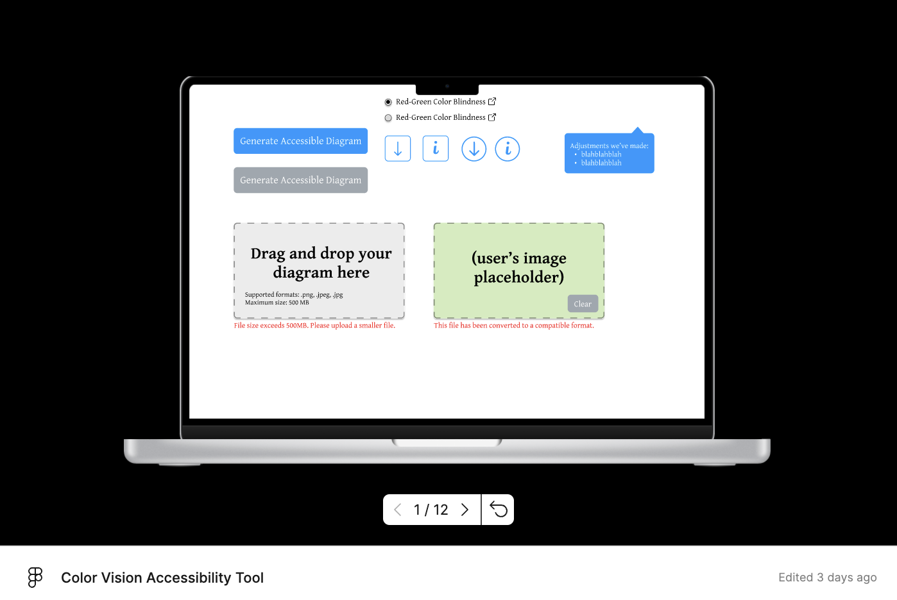

# Updated Problem Statement:
Some colorblind students in the course may struggle to interpret figures that rely heavily on color for differentiation, which can hinder their learning efficiency. Moreover, these students often **find their own workarounds** instead of reporting the issue, either because they do not want to *be treated differently* or simply *prefer to keep this need private*.

On the other hand, TAs may **unintentionally** create lecture slides with figures that depend on color differentiation, making them inaccessible to colorblind students. This happens either because they are **unaware of the issue** or because they **do not realize there are students in their course who need this accommodation**—especially since students rarely report their needs.

As a result, an ongoing accessibility gap remains, with affected students struggling to understand visual materials effectively.

# Paper prototype:

[//]: # (<iframe width="100%" height="475" src="https://embed.figma.com/proto/66YLf7nN2Ez0BIp0FIVnY4/Color-Vision-Accessibility-Tool?node-id=1-31&p=f&t=xUsRHa7KvmT68NWZ-0&embed-host=github" allowfullscreen></iframe>)
[//]: # (<iframe width="100%" height="475" src="https://embed.figma.com/design/66YLf7nN2Ez0BIp0FIVnY4/Color-Vision-Accessibility-Tool?embed-host=github" allowfullscreen></iframe>)

# Takeaways from the feedback:
- **Enhance usability** by adding download buttons for easier access to processed files.  
- **Improve clarity** by including more instructional text to guide users through the tool’s features.  
- **Strengthen security** by implementing file screening to prevent misuse of the upload function.

# Design Goals:
We identified four key design goals for developing a tool that helps ensure educational materials are accessible to colorblind students. These goals are informed by our research and feedback from our user research.

## Goal 1: Support Knowledge Building
1. **What is the goal?** To provide teaching assistants (TAs) with the necessary knowledge and resources to understand how colorblind students perceive figures and how to create accessible visual materials.
2. **Why is it important?**
Many TAs are unaware of accessibility issues related to color blindness. User research indicated that TAs often do not consider accessibility when designing lecture slides, either because they are unaware of the issue or do not realize students have this need. One TA mentioned, "I didn’t even think about color blindness when preparing my slides. No one ever brought it up." 
3. **How will you design for this goal?** The tool will:
   1. Provide insights into how colorblind students perceive figures.
   2. Include external links to general information about color blindness.
   3. Offer educational components on accessibility best practices, with resources for further learning.
   4. Provide code snippets and tutorials, tailored to the TA's preferred programming language or tool, demonstrating how to create accessible visuals.

## Goal 2: Enable Flexibility for Instructors
1. **What is the goal?**
To offer TAs multiple adjustment options for improving figure accessibility, while allowing those who prefer manual adjustments to receive guidance tailored to their specific tools and coding environments.
2. **Why is it important?**
Different TAs have diverse teaching styles and technical preferences. User research showed that some TAs prefer adding patterns, while others want to change the colors. There are some needs to retain control over the final output, especially when maintaining high resolution of their figure. 
3. **How will you design for this goal?** The tool will:
   1. Provide alternative adjustments, such as adding patterns or changing colors of the figure.
   2. Include an option where TAs can choose their coding language or design tool and receive some general instructions on how to apply accessibility improvements within that specific context.

## Goal 3: Emphasize Accessibility
1. **What is the goal?**
To ensure all figures and visual elements are accessible to students with color vision deficiencies.
2. **Why is it important?**
The primary goal of this tool is to bridge the accessibility gap. Research highlights that students with disabilities often do not report issues due to fear of being treated differently. One student shared, "I usually just try to manage on my own. I don’t want to seem like I need special treatment." Ensuring accessibility can increase the learning efficiency of colorblind students
3. **How will you design for this goal?** The tool will:
   1. Automatically analyze figures for color-based accessibility issues (e.g., red-green confusion).
   2. Highlight problematic visuals and suggest adjustments such as adding patterns or changing colors.

## Goal 4: Ensure Fast Response and Ease of Use
1. **What is the goal?**
To create a tool that is quick to respond and self-explanatory, minimizing the time and effort required for TAs to conduct accessibility checks.
2. **Why is it important?**
User research showed that TAs often do not want to spend too much time on accessibility checks. Among 7 TAs we interviewed, 6 of them don’t want to spend more than 5 minutes per slides for accessibility check
3. **How will you design for this goal?** The tool will:
   1. Use a streamlined interface with minimal setup and a clear, guided workflow.
   2. Provide instant analysis of figures and generate actionable suggestions within seconds.

# Formal Publication Style Design Goals: 
We refer to the paper *Design Goals for Playful Technology to Support Physical Activity Among Wheelchair Users* published at CHI 2019.
https://dl.acm.org/doi/10.1145/3290605.3300262 

#### Design Goal 1: Support Knowledge Building

Many TAs are unaware of how colorblind students perceive visual materials (Relevant Factor: Knowledge). To address this, the tool should provide clear explanations of the challenges colorblind students face and offer resources on accessibility best practices. It should also link to external guidelines and tutorials, including code snippets that show how to make figures more accessible in different programming languages.  
Reflections on tools that support knowledge building:  
Existing resources, like WCAG guidelines and color simulators, help raise awareness but don’t always provide practical implementation steps. By integrating knowledge-building features directly into the tool, we can make it easier for instructors to learn and apply accessibility improvements without extra effort.

#### Design Goal 2: Enable Flexibility for Instructors

Different instructors have different ways of preparing their teaching materials, so the tool should be adaptable to various workflows (Relevant Factor: Perceived Control). It should offer both automated suggestions and manual adjustment options, giving instructors the choice to modify figures themselves if they prefer. If an instructor wants to make changes manually—perhaps to preserve high resolution—the tool should provide targeted guidance based on the software or programming language they are using.  
Reflections on tools that support flexible workflows:  
Most existing accessibility tools, like contrast checkers, apply a one-size-fits-all approach, which may not work for all instructors. A tool that adapts its recommendations to different formats and workflows will be more useful and widely adopted.

#### Design Goal 3: Emphasize Accessibility

The primary goal of this tool is to ensure that visual materials are accessible to students with color vision deficiencies (Relevant Factor: Attitude \- Experiential Attitude). It should prioritize accessibility-first design principles and encourage instructors to integrate colorblind-friendly visuals into their teaching materials.  
Reflections on accessibility in visual materials:  
Research shows that inaccessible visuals can significantly impact students’ learning experiences. While some instructors are familiar with general accessibility principles, many don’t realize how color contrast, alternative patterns, and colorblind-friendly palettes affect students. By embedding accessibility checks into the workflow, we can help prevent these issues before they become barriers.

#### Design Goal 4: Ensure Fast Response and Ease of Use

TAs are often busy and may not have time for complicated accessibility checks (Relevant Factor: Habit). The tool should be quick, intuitive, and require minimal effort to use. It should provide clear, actionable suggestions that don’t require extensive training.  
Reflections on usability in accessibility tools:  
Many accessibility tools are effective but require users to have specialized knowledge. By making this tool self-explanatory and integrating it smoothly into existing workflows, we can reduce the effort required from instructors and encourage more widespread use.
