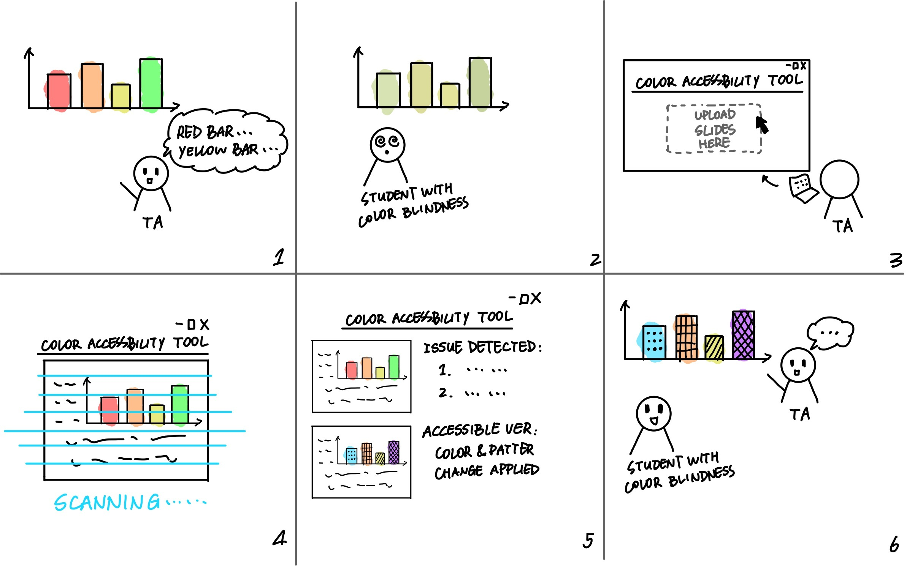

# User Research from Visual Accessiblity Group
- [User Research from Visual Accessiblity Group](#user-research-from-visual-accessiblity-group)
- [1. Before getting started with users](#1-before-getting-started-with-users)
  - [1.1 Assumptions](#11-assumptions)
  - [1.2 Open-ended questions](#12-open-ended-questions)
  - [1.3 Methodology](#13-methodology)
  - [1.4 Research protocol](#14-research-protocol)
    - [Recruitment strategy:](#recruitment-strategy)
    - [Time and place:](#time-and-place)
    - [Roles:](#roles)
- [2. Conducting user research](#2-conducting-user-research)
  - [2.1 User research with the colorblind students](#21-user-research-with-the-colorblind-students)
  - [2.2 User research with Teaching Assistants](#22-user-research-with-teaching-assistants)
  - [2.3 User research with the experts](#23-user-research-with-the-experts)
- [3. Insights from user research](#3-insights-from-user-research)
  - [3.1 Synthesizing the user research](#31-synthesizing-the-user-research)
    - [Persona 1: Teaching Assistant (HF, 26, Computer Science TA)](#persona-1-teaching-assistant-hf-26-computer-science-ta)
    - [Persona 2: Colorblind Student (MZ, 19, Engineering Major, Deuteranopia)](#persona-2-colorblind-student-mz-19-engineering-major-deuteranopia)
    - [Process map:](#process-map)
      - [Current Process: TA Creating Slides](#current-process-ta-creating-slides)
      - [Current Process: Colorblind Student Interacting with Slides](#current-process-colorblind-student-interacting-with-slides)
      - [Insights from the Process Map:](#insights-from-the-process-map)
  - [3.2 Problem statemement](#32-problem-statemement)
    - [Core Tension:](#core-tension)
  - [3.3 Storyboard](#33-storyboard)
  - [3.4 Survey on existing tools](#34-survey-on-existing-tools)
- [4. Blog](#4-blog)
- [5. Reflection](#5-reflection)

# 1. Before getting started with users

## 1.1 Assumptions
In this project, we focus on the visual accessiblity of academic materials. An assumption is that there are some color blind students that cannot or hard to differ certain colors, and the Teaching Assistants (TA) or the lecturers might not realize this question.
Specifically, we make the following assumptions about our users and usage contexts:
1. Indoor learning environment; users (color blind students) cannot/hard to differ certain colors 
2. scenario: discussion section/lecture, where students cannot access the academic materails (such as slides) in advance
3. TA/Lecturers might not pay attention to the accessibility issue in their figures

## 1.2 Open-ended questions
1. How often do students with visual impairments need help during lectures/discussions?
2. What are the state-of-the-art solutions?
3. How likely are students to voice their needs?
4. How much are TAs/lectures aware of the needs of students?

## 1.3 Methodology
We choose **Interview** as our user research methodology. This is because:
1. interviews provide direct insights into user challenges and needs.
2. it helps us understand accessibility gaps and gather qualitative feedback from colorblind students, TAs, and specialists. 
3. this method ensures we capture real-world experiences to inform our solution.

## 1.4 Research protocol
Our research protocol is as follows:

### Recruitment strategy: 
- **Whom to contact:** colorblind students, TAs, and specialists from the UCLA Center for Accessible Education (CAE)
- **How to contact:** recruit colorblind students from two public forums; TA from UCLA CS departments
- **How many:** 3 colorblind students, 7 TAs, and 2 specialists 
### Time and place: 
Depending on participants’ preference, we can conduct interviews online or in-person
### Roles: 
**Interviewers**: Tiffany Zhou, Shanmu Wang, **Note taker**: Xiaojie Zhou

# 2. Conducting user research

## 2.1 User research with the colorblind students

## 2.2 User research with Teaching Assistants

## 2.3 User research with the experts

# 3. Insights from user research

## 3.1 Synthesizing the user research
We synthesize our user research into two personas and two scenarios as follows:
### Persona 1: Teaching Assistant (HF, 26, Computer Science TA)
- A graduate TA, teaching discussion sections.
- Primarily slides with some figures for teaching; unaware of accessibility concerns for colorblind students.
- **Pain Points**:
  - Doesn’t realize figures in slides may be inaccessible.
  - No established strategy for checking color accessibility.
  - Assumes that students will report issues if they exist.
- **Scenario 1**:
HF is preparing slides for a discussion section. He uses red and green to distinguish categories in a bar chart but doesn’t consider accessibility. After finalizing the slides, he moves on to the next task, never checking if colorblind students might struggle to differentiate elements.

### Persona 2: Colorblind Student (MZ, 19, Engineering Major, Deuteranopia)
- An undergraduate student with red-green color blindness.
- Behaviors:
  - Struggles with figures that use only color, especially with red and green to convey meaning
  - Avoids reporting the issue to the TA to not appear "needy" or "difficult."
  - Develops workarounds (e.g., using a phone to take photos and using color adjustment apps).
  - Takes extra time to understand slides, often falling behind in lectures.
- **Scenario 2:**
MZ is attending a discussion session. The TA shows a barplot where key bars are distinguished using red and green dots. MZ struggles to differentiate them and loses time figuring it out, missing other explanations.

### Process map:
We also synthesize our research into a process map that shows the current steps TAs and colorblind students take when working with slides and the pain points they encounter.

#### Current Process: TA Creating Slides
1. TA designs slides using default colors. *(No awareness of accessibility issues.)*
2. TA adds figures with color-coded differentiation. *(No accessibility check.)*
3. TA finalizes slides. *(No feedback loop to ensure accessibility.)*
4. TA gives discussion sections or lectures to students. *(Colorblind students may struggle but don’t report issues.)*

#### Current Process: Colorblind Student Interacting with Slides
1. Students attend class and view slides. *(Unaware of accessibility beforehand.)*
2. Students struggle to differentiate key visual elements. *(Extra cognitive load.)*
3. Students find workarounds themselves (e.g., external apps, paying more attention, guessing) as they don’t want to be treated differently 
4. TA never receives feedback, and the issue persists.

#### Insights from the Process Map:
- TA doesn’t check for accessibility because they don’t know it’s an issue (lack of awareness) or don’t want to waste time doing so.
- Colorblind students might struggle but don’t report it, perpetuating the problem.

## 3.2 Problem statemement
TAs often unknowingly create lecture slides with figures that rely on color differentiation, making them difficult for colorblind students to interpret. Because TAs are unaware of the issue and colorblind students tend to find workarounds themselves and not to report it, this results in a persistent accessibility gap where students struggle to understand visual materials efficiently.

### Core Tension:
- **What users want to do:** TAs want to create clear slides, and colorblind students want to quickly interpret visual materials.
- **What users have to do:** TAs unknowingly make inaccessible slides, and colorblind students spend extra effort trying to interpret unclear visuals.

## 3.3 Storyboard

To illustrate the workflow of our tool, we have developed a storyboard that outlines the key steps involved in improving the accessibility of presentation slides for colorblind individuals. 

This storyboard demonstrates how a TA can use the tool to detect and resolve color-based accessibility issues in figures, ensuring that students with color vision deficiencies can better understand the material.

The process begins with a common accessibility issue—students struggle to interpret certain figures in the slides due to colorblindness. To address this, the TA uploads the slides to the tool, which then scans the figures for potential color-related accessibility issues, such as red-green confusion. The tool identifies problematic visuals and provides recommendations for improvements, such as adding patterns or textures, adjusting color contrast, or incorporating alternative annotations. With these suggestions, the TA makes necessary adjustments, resulting in more accessible slides that enhance student comprehension.

The following storyboard visually represents this process:

## 3.4 Survey on existing tools
We have investigated several tools assist in designing accessible color schemes or simulating how colorblind individuals perceive visuals. 
The table below provides an overview of existing accessibility tools, highlighting their capabilities, strengths, and limitations in evaluating and improving visual accessibility.

| Tool | Description | Strengths | Limitations |
|------|------------|-----------|-------------|
| [**Anthology Ally for Canvas**](https://www.blackboard.com/teaching-learning/accessibility-universal-design/blackboard-ally-lms) | Anthology Ally is primarily an accessibility tool designed to help improve the accessibility of digital content, particularly in learning management systems (LMS) like Canvas. | It can identify missing descriptions in figures or low contrast text in the slides; can Converts course content into different formats (e.g., audio, ePub, HTML) to support diverse learning needs | Does not analyze color usage in figures. |
| [**DaltonLens**](https://daltonlens.org/) | A Python package for simulating how colorblind individuals perceive the world. | Useful for developers and designers creating accessible visuals. | Does not directly check presentation slides or provide feedback. |
| [**Color Oracle**](https://colororacle.org/) | Simulates colorblind vision on-screen to help evaluate accessibility. | Provides real-time simulation for multiple types of color blindness. | Does not generate accessible palettes or modify slides directly. |
| [**Microsoft PowerPoint Accessibility Checker**](https://support.microsoft.com/en-us/office/improve-accessibility-with-the-accessibility-checker-a16f6de0-2f39-4a2b-8bd8-5ad801426c7f#PickTab=Windows) | Identifies common accessibility issues in Microsoft Office apps including Outlook, Excel, and PowerPoint. | Detects missing alt text, contrast issues, and reading order problems. | Does not focus on color blindness in figures. |
| [**Viz Palette**](https://projects.susielu.com/viz-palette) | Helps design colorblind-friendly palettes. | Allows users to test and refine color schemes for accessibility. | Cannot check uploaded slides for existing color issues. |

While these tools provide valuable support in enhancing accessibility, they do not address the specific challenge of identifying figures in academic materials that may be problematic for colorblind students. 

# 4. Blog
[Read Our Blog in Details](./Blog.md)

# 5. Reflection