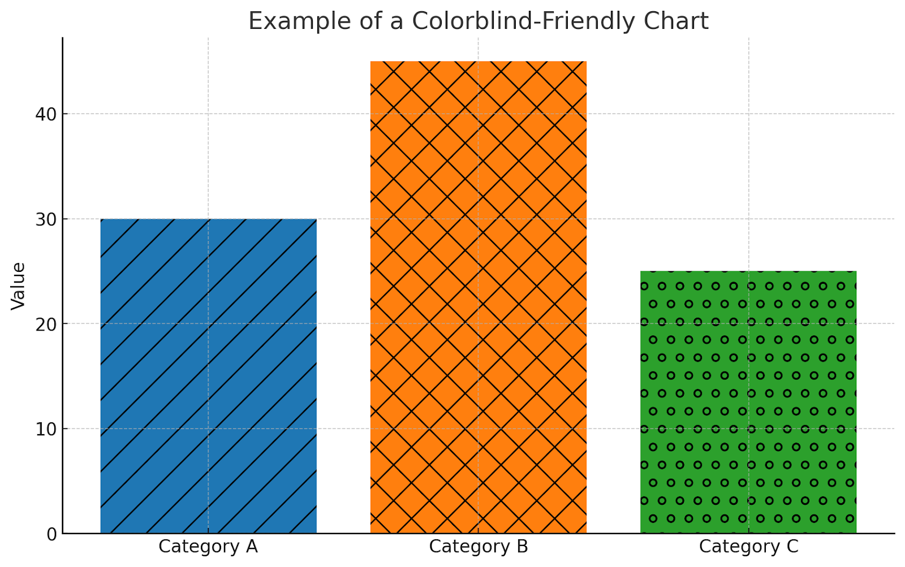
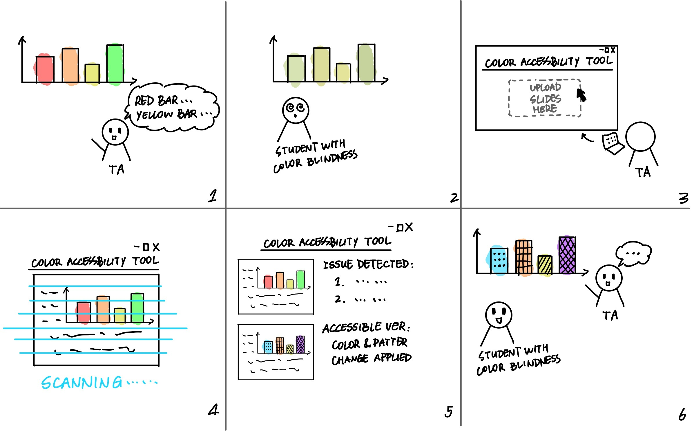

[Back to Main](./User_Research.md)

# Making Learning Materials More Accessible for Color-Blind Students

Color blindness affects approximately 1 in 14 men and 1 in 200 women, yet many educational materials remain inaccessible. To explore this issue, we conducted a user study on color accessibility in academic materials.

## Methods
We interviewed three color-blind students to understand their challenges, seven teaching assistants (TAs) to assess their awareness, and two specialists from the Center for Accessible Education (CAE) at UCLA. Our questions focused on their experiences, challenges, and potential solutions.

## Key Findings
### Student Challenges
- Many students struggle with color-dependent visuals such as bar charts, line graphs, and heatmaps.
- Most students do not report accessibility issues, fearing inconvenience or being perceived as "needy."
- Workarounds include adjusting colors manually, using external apps, or asking a friend for help.
- Some students noted that instructors rarely consider color accessibility when designing materials.

### TA Awareness and Practices
- The majority of TAs were unaware of color accessibility concerns and do not check their materials for accessibility.
- Some TAs were open to improving accessibility but lacked the tools or guidance to implement changes.
- No formal training on color accessibility was provided to most TAs.
- Many TAs expressed interest in an automated tool to detect and fix color accessibility issues in their slides.

### Institutional Support
- CAE provides material modification services, such as color adjustments and pattern overlays.
- Bruin Learn, UCLA’s learning platform, offers automated accessibility checks but does not specifically flag color-related issues.
- The Disabilities & Computing Program (DCP) offers resources on accessible design, but awareness among instructors remains low.
- The interviewee recommended consulting DCP for more details about Ally and Bruin Learn’s accessibility features.

## Problem Statement
TAs often unknowingly create lecture slides with figures that rely on color differentiation, making them difficult for color-blind students to interpret. Because TAs are unaware of the issue and color-blind students tend to find workarounds themselves and not report it, this results in a persistent accessibility gap where students struggle to understand visual materials efficiently.

## Storyboard
To illustrate the workflow of our tool, we have developed a storyboard that outlines the key steps involved in improving the accessibility of presentation slides for colorblind individuals.

This storyboard demonstrates how a TA can use the tool to detect and resolve color-based accessibility issues in figures, ensuring that students with color vision deficiencies can better understand the material.

The process begins with a common accessibility issue—students struggle to interpret certain figures in the slides due to colorblindness. To address this, the TA uploads the slides to the tool, which then scans the figures for potential color-related accessibility issues, such as red-green confusion. The tool identifies problematic visuals and provides recommendations for improvements, such as adding patterns or textures, adjusting color contrast, or incorporating alternative annotations. With these suggestions, the TA makes necessary adjustments, resulting in more accessible slides that enhance student comprehension.

The following storyboard visually represents this process:

## Proposed Solution
We propose a standalone web-based tool that scans slides for color accessibility issues and suggests improvements. The tool would:
- Analyze uploaded slides for colorblind accessibility issues.
- Provide real-time feedback and suggest modifications, such as adding patterns, adjusting contrast, or overlaying text labels.
- Generate alternative versions of visuals to ensure students can access content without relying on color alone.
- Encourage proactive accessibility measures by providing guidelines and best practices for instructors.

## Next Steps
- Develop and test a prototype to refine its features based on user feedback.
- Conduct additional interviews with both students and instructors to validate the tool’s effectiveness.
- Raise awareness among instructors about color accessibility and encourage adoption of accessible design practices.
- Explore the potential development of an independent accessibility tool for students to use, allowing them to overcome challenges more autonomously.

By increasing awareness and providing better tools, we can create a more inclusive learning environment where color-blind students can fully engage with academic materials without barriers.

